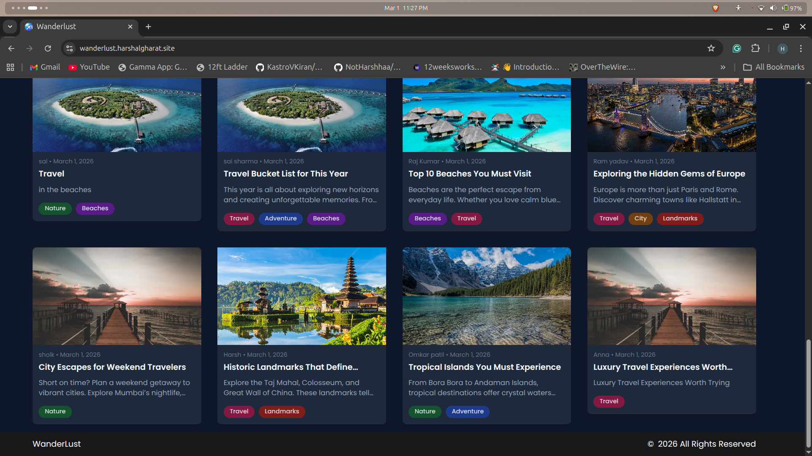
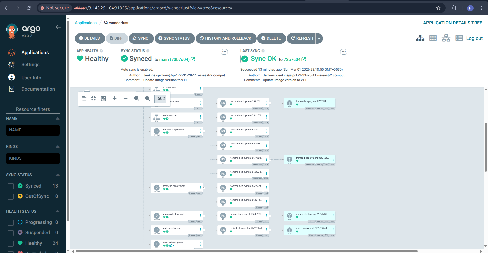
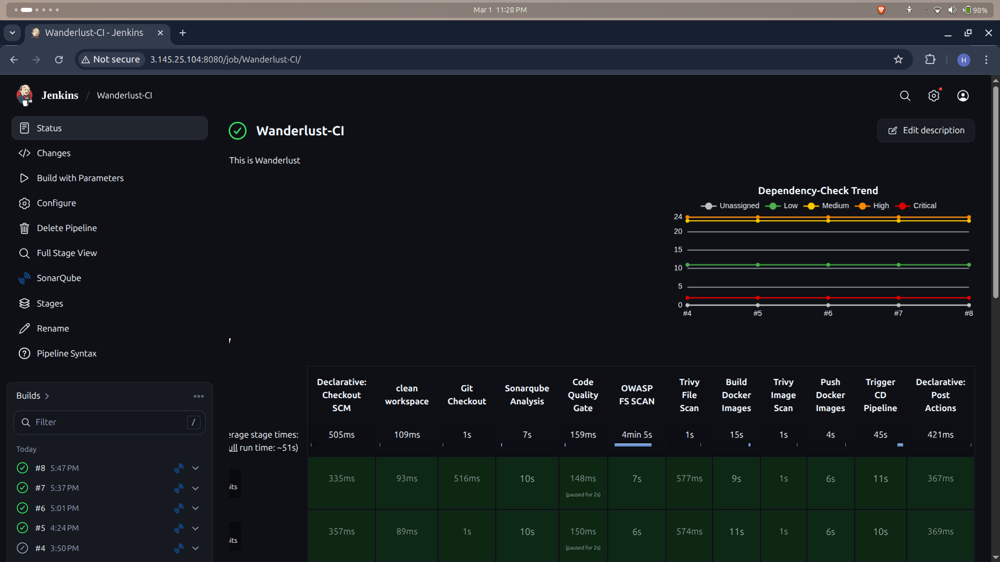
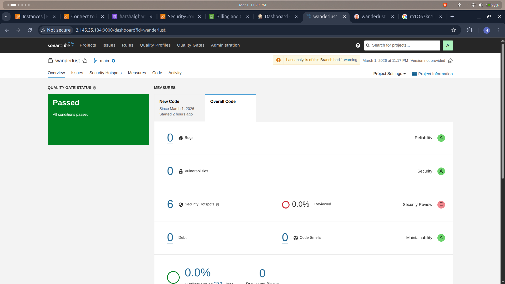
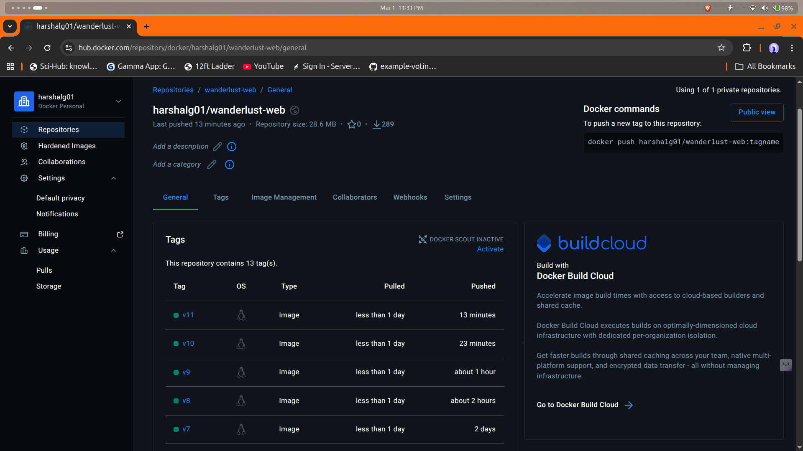
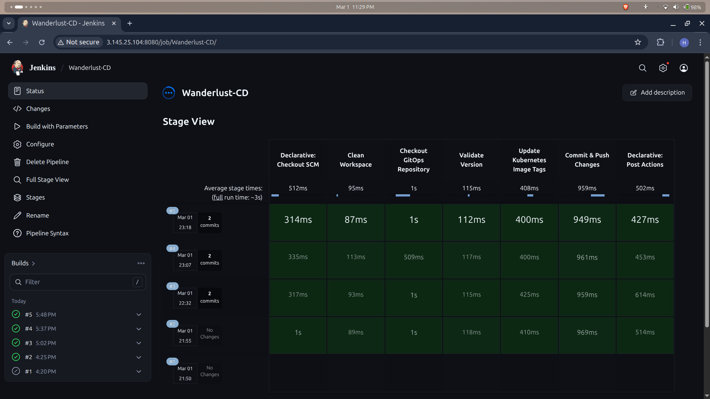
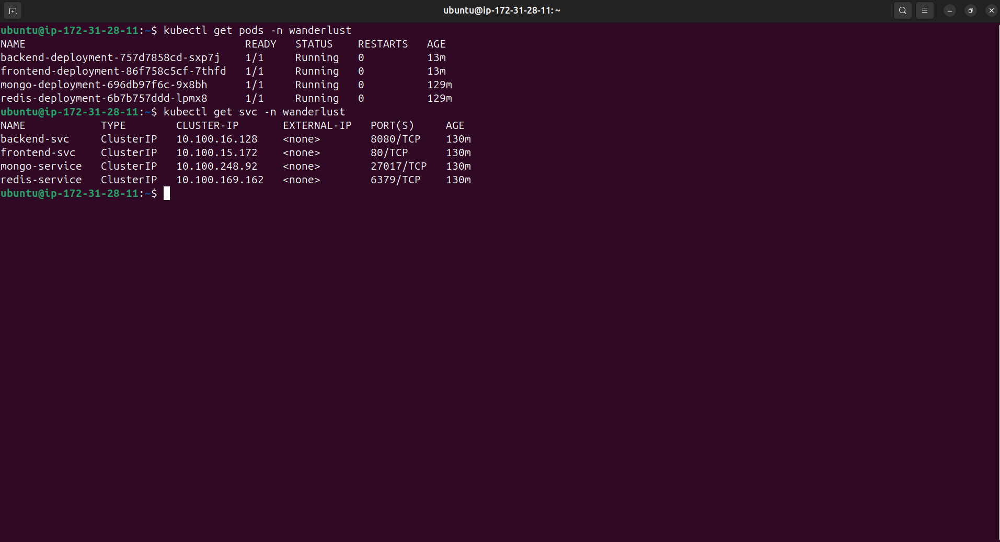
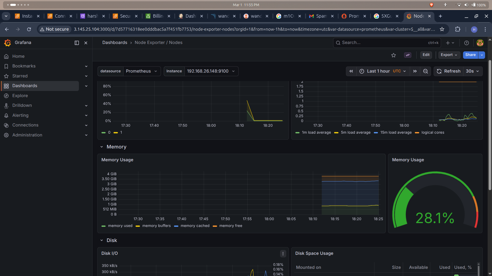
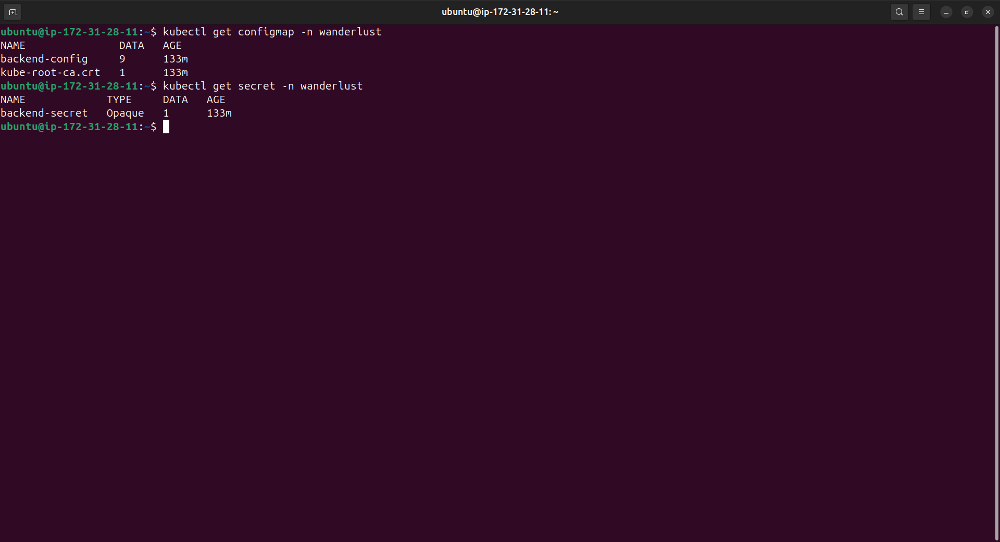

# 🌍 Wanderlust – Production Grade MERN DevSecOps Deployment on AWS EKS

🔗 **Live Application:**  
https://wanderlust.harshalgharat.site  




Deployed on Amazon EKS using ALB Ingress and secured with AWS Certificate Manager (HTTPS).

---

## 📚 Contents

- [Overview](#-project-overview)
- [Architecture](#-high-level-architecture)
- [Tech Stack](#-tech-stack)
- [Infrastructure Setup](#-infrastructure-setup)
- [AWS Load Balancer Controller](#-aws-load-balancer-controller-setup)
- [GitOps with ArgoCD](#-gitops-with-argocd)
- [CI/CD Pipeline](#-cicd-pipeline-devsecops)
- [Monitoring Setup](#-monitoring-prometheus--grafana)
- [Configuration Management](#-configuration-management)
- [Challenges Solved](#-challenges-solved)
- [Assets/images Required](#-Assets/images-required)
- [Future Improvements](#-future-improvements)


---

# 📌 Project Overview

Wanderlust is a production-ready MERN travel blog application deployed on AWS using a complete **DevSecOps + GitOps pipeline**.

This project demonstrates:

- Containerized MERN application
- Automated CI/CD using Jenkins
- DevSecOps security scanning
- Kubernetes deployment on Amazon EKS
- ALB-based Ingress with SSL
- GitOps deployment using ArgoCD
- Monitoring with Prometheus & Grafana
- Secure configuration using ConfigMaps & Secrets

---

# 🏗 High-Level Architecture


---

# 🧱 Tech Stack

## Application Stack

| Layer | Technology |
|--------|------------|
| Frontend | React (Vite) |
| Backend | Node.js + Express (MVC) |
| Database | MongoDB |
| Caching | Redis |
| Web Server | Nginx |

---

## DevOps & Cloud Stack

| Category | Tools Used |
|------------|------------|
| Containerization | Docker |
| CI Pipeline | Jenkins |
| Code Quality | SonarQube |
| Dependency Scan | OWASP Dependency Check |
| Image & FS Scan | Trivy |
| Container Registry | DockerHub |
| Orchestration | Amazon EKS |
| Ingress | AWS Load Balancer Controller |
| GitOps | ArgoCD |
| Monitoring | Prometheus + Grafana (Helm) |
| DNS | Route53 |
| SSL | AWS Certificate Manager |
| Configuration | ConfigMap + Kubernetes Secrets |

---

# ☁️ Infrastructure Setup

### 1️⃣ Create EKS Cluster

```bash
eksctl create cluster \
  --name wanderlust \
  --region us-east-2 \
  --without-nodegroup
```

---

### 2️⃣ Associate OIDC Provider

```bash
eksctl utils associate-iam-oidc-provider \
  --cluster wanderlust \
  --region us-east-2 \
  --approve
```

---

### 3️⃣ Create Nodegroup

```bash
eksctl create nodegroup --cluster=wanderlust \
                     --region=us-east-2 \
                     --name=wanderlust-ng \
                     --node-type=t2.medium \
                     --nodes=2 \
                     --nodes-min=2 \
                     --nodes-max=5 \
                     --node-volume-size=19 \
                     --ssh-access \
                     --ssh-public-key=blog-key 
```

---

### 4️⃣ Install AWS Load Balancer Controller (Helm)

```bash
helm repo add eks https://aws.github.io/eks-charts

helm install aws-load-balancer-controller eks/aws-load-balancer-controller \
  -n kube-system \
  --set clusterName=wanderlust
```

ALB is automatically created when Ingress resource is applied.

### 🖼️ Ingress Resource


### 🖼️ AWS ALB Console


### 🖼️ Route53 DNS Record


---

---

# 🔄 GitOps Deployment (ArgoCD)

## Install ArgoCD

```bash
kubectl create namespace argocd

kubectl apply -n argocd -f https://raw.githubusercontent.com/argoproj/argo-cd/stable/manifests/install.yaml
```
---

## Check Available Clusters

```bash
kubectl config get-contexts

shows argocd cluster list

```

---
## Import EKS Cluster into ArgoCD

```bash
argocd cluster add harshal-eks@wanderlust.us-east-2.eksctl.io --name wanderlust-eks
```

ArgoCD continuously syncs Kubernetes manifests from GitOps repository.

### 🖼️ ArgoCD — Synced & Healthy



---

# 🔐 CI/CD Pipeline (DevSecOps)

## Jenkins CI Stages

- Code Checkout
- SonarQube Analysis
- Quality Gate Validation
- OWASP Dependency Scan
- Trivy Filesystem Scan
- Docker Image Build
- Trivy Image Scan
- Push Versioned Image


### 🖼️ CI Pipeline — All Stages



---
### 🖼️ SonarQube — Quality Gate Passed



---

### 🖼️ DockerHub — Versioned Images
---



---


---


## Jenkins CD Stages

- Update Kubernetes Image Tag
- Push to GitOps Repository
- Trigger ArgoCD Sync
- Rolling Update Deployment

### 🖼️ CD Pipeline — Deploy & Sync



---


## ☸️ Kubernetes Cluster




---

---

# 📊 Monitoring (Helm Based)

```bash
helm repo add prometheus-community \
  https://prometheus-community.github.io/helm-charts

kubectl create namespace prometheus

helm install monitoring \
  prometheus-community/kube-prometheus-stack \
  -n prometheus

```
Prometheus and Grafana exposed via ALB Ingress.

### 🖼️ Grafana — Cluster Dashboard


 

### 🖼️ Prometheus — All Targets UP


---

# 🔑 Configuration Management

- No environment variables baked into Docker images
- ConfigMap for application configuration
- Kubernetes Secret for sensitive values
- SSL handled via ACM
- Path-based routing via Ingress

## 🖼️ ConfigMap & Secrets


---


# 🔥 Challenges Solved

- Fixed ALB not creating due to missing OIDC association
- Resolved Ingress path routing conflict (/api duplication issue)
- Debugged Service port mismatch (80 vs 5173)
- Fixed Target Group unhealthy issue
- Implemented secure SSL termination via ACM
- Configured GitOps auto-sync workflow

---

# 🚀 Future Improvements

- Horizontal Pod Autoscaler (HPA)
- Use RDS instead of in-cluster MongoDB
- Private subnets for backend services
- Add CI caching optimization
- Terraform-based infrastructure provisioning
---


# 👨‍💻 Author

Harshal Gharat  
DevOps | Kubernetes | AWS | DevSecOps